<div align="center">
  <p><strong>English</strong> · <a href="README.zh-CN.md">简体中文</a></p>
  
  <h1>Wordless</h1>
  <p><strong>Less talk. Finish the work.</strong></p>
  <p>A local-first Agent platform for real tasks: focused context, fewer wasted tokens and round trips, and editable, verifiable deliverables.</p>

  <p>
    <a href="https://github.com/Austin-Patrician/Wordless/releases/latest"></a>
    <a href="https://github.com/Austin-Patrician/Wordless/actions/workflows/release-desktop.yml"></a>
    
    
    <a href="LICENSE"></a>
  </p>

  <p>
    <a href="https://github.com/Austin-Patrician/Wordless/releases/latest"><strong>Download the latest release</strong></a>
    ·
    <a href="apps/website/src/content/docs/en/docs/index.mdx">User manual</a>
    ·
    <a href="docs/architecture/overview.md">Architecture</a>
    ·
    <a href="https://github.com/Austin-Patrician/Wordless/issues">Report an issue</a>
  </p>
</div>

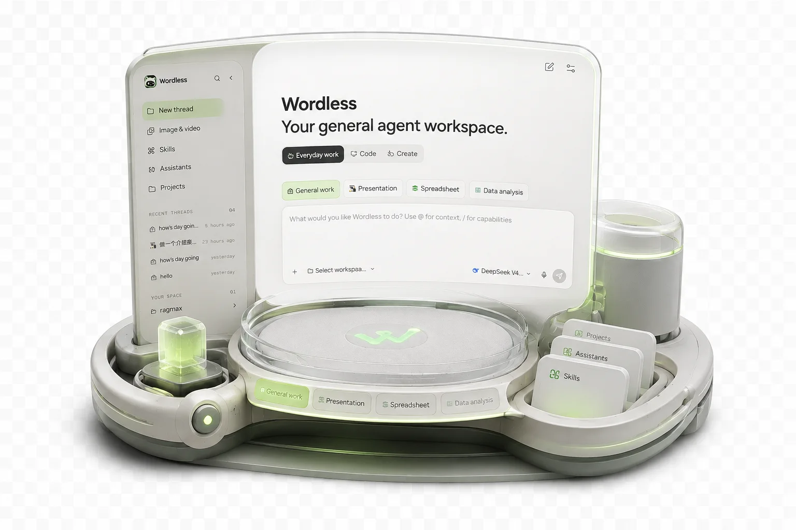

## What is Wordless?

Wordless is not another chat window that only returns text. It is an Agent workbench for macOS and Windows: select a workspace, model, and work mode, then let the Agent read context and invoke tools within explicit permission boundaries. Presentations, spreadsheets, research results, and code changes stay visible in the same interface where the work happens.

Wordless is local-first. Workspaces, conversations, and artifacts remain on your device. Google sign-in and cloud sync are optional, so local work continues when you are signed out or offline.

## Why we built Wordless

Most AI products are optimized to produce an answer. Real work needs something stricter: understand only the relevant context, take the right action, leave a usable artifact, and verify what happened. Wordless is built around that outcome rather than around a longer conversation.

- **Output before narration**: execution status belongs in the interface. The model should spend its response on decisions, results, and exceptions instead of repeatedly describing progress.
- **Scoped context before bulk ingestion**: `@` references, workbook selections, presentation elements, and work-mode Profiles narrow the input to what the task actually needs.
- **Tokens spent on useful work**: task-specific tools, context compaction, and provider cache accounting are designed to reduce repeated or irrelevant context.
- **End-to-end delivery**: planning, tool execution, artifact creation, inspection, and correction remain in one task instead of stopping at advice.
- **Verification before confidence**: tests, quality scans, sources, diffs, tool results, and interactive previews make the result inspectable.

> [!NOTE]
> "Fewer tokens" is a design objective, not a fixed savings guarantee. Actual usage depends on the model, provider, task, selected context, and number of correction rounds. "Finish the work" means minimizing avoidable handoffs and round trips, not pretending every complex task can be completed correctly in one model turn.

## Why Pi Agent Harness

Wordless uses the MIT-licensed [Pi Agent Harness](https://github.com/earendil-works/pi) as its agent foundation instead of rebuilding a generic model and tool loop. Pi provides the portable primitives; Wordless turns them into scenario-specific desktop workflows.

| Product need | Pi foundation | Wordless adaptation |
| --- | --- | --- |
| Multiple model providers | Unified streaming API and model capability data | Visual provider configuration, reasoning depth, credential storage, and usage display |
| Multi-step execution | Agent loop, structured tool calls, events, and state | Approval checkpoints, risk handling, visible tool states, persistence, and recovery |
| Different kinds of work | Composable tools and a UI-independent core | Profiles, Drivers, Extensions, specialized capabilities, and artifact workbenches |
| Long-running context | Continuable message and Agent state | Session journal, search, context compaction, steering, and follow-up handling |

```text
Task intent
    -> Profile
    -> Driver + Extensions
    -> Pi-derived agent loop
    -> Capabilities and workspace policy
    -> Interactive artifact surface
```

One loop does not mean one generic Agent. Each Profile deliberately changes the context, tools, permission declarations, execution guidance, artifact type, and verification surface:

| Profile | Scenario adaptation |
| --- | --- |
| General | Everyday work, Skills, MCP, and optional workspace tools |
| Coding | Indexed search, file edits, Shell, tests, diffs, and coding policy |
| Presentation | OfficeCLI-backed slide tools, quality scans, and interactive PPTX preview |
| Spreadsheet | Workbook selections, formulas, charts, quality checks, and publishing |
| Data Analysis | Data inspection, confirmed research plans, delegated dimensions, sources, and reports |

This separation keeps Pi replaceable. Provider protocols live behind `@wordless/ai`, the loop and events behind `@wordless/agent`, and concrete runtime integration behind the Driver SDK. Upgrading Pi or introducing another Driver should change adapters and event mapping rather than every Composer, approval, storage, and artifact UI.

## Wordless and Tencent WorkBuddy

Wordless and Tencent WorkBuddy both aim to move beyond chat and deliver real work. They take different product routes. The comparison below is based on Tencent's public [WorkBuddy product page](https://cloud.tencent.com/product/workbuddy) and [official overview](https://www.workbuddy.cn/docs/workbuddy/Overview) available in August 2026; capabilities and commercial plans may change.

| Dimension | Wordless | Tencent WorkBuddy |
| --- | --- | --- |
| Product route | Local-first, source-available Agent platform for users who want to control models, tools, permissions, and extensions | Turnkey commercial workplace Agent for broad business roles and managed adoption |
| Scenario composition | Repository-visible Profiles, Drivers, Extensions, Skills, and MCP integrations | Domain experts, Skills, project spaces, and multi-Agent collaboration |
| Models and cost | Bring your own provider and API key; usage is billed by the selected provider | Tencent-operated product and quota plans, with model configuration exposed through its product experience |
| Data and execution | Conversations and artifacts stay local by default; workspace policy and explicit approvals gate tool execution | Can operate authorized local folders while account, service, and team boundaries follow the Tencent product |
| Artifact experience | Dedicated in-app PPT and spreadsheet previews support selecting an object or range and continuing from that exact context | Covers broad document, spreadsheet, PPT, research, coding, and creative delivery workflows |
| Collaboration and ecosystem | Currently optimized for individual, local workflows with optional settings sync and developer-controlled extensions | Project spaces, shared experts, Skills, connectors, team reuse, and the Tencent ecosystem |
| Transparency and customization | Source-visible architecture, BYOK models, explicit event and permission boundaries, replaceable adapters | Managed product with a larger ready-made expert and service ecosystem |

Choose WorkBuddy when you want a mature, ready-made office and team ecosystem with managed experts. Choose Wordless when local-first data, BYOK models, explicit approvals, source-visible architecture, and deep workflow customization matter more. This is a difference in product priorities, not a claim that one tool is universally better.

## Core capabilities

- **Workspace context**: use `@` to reference workspace files and folders, and `$` to select Skills. File indexing respects `.gitignore`.
- **Controlled tool execution**: tool calls require manual approval by default. Session auto-approval is available, while high-risk actions return to explicit review. One-time access outside the workspace is also supported.
- **Interactive Presentation**: after the Agent creates or edits slides, inspect pages, select elements, and continue iterating in the right workspace instead of downloading a one-off file.
- **Interactive Spreadsheet**: inspect cells, charts, and changes directly. Continue from the current selection and verify updates immediately.
- **Data Analysis and deep research**: divide research into dimensions, delegate work in parallel, follow progress, and return reports and charts to the workspace.
- **Coding workflow**: combine planning, file search, Shell, diffs, and test results into reviewable code changes.
- **Models and reasoning depth**: configure built-in and OpenAI-compatible providers, Base URLs, model capabilities, context limits, and reasoning levels.
- **Skills & MCP**: import reusable Skills and connect external services compatible with the Model Context Protocol.
- **Conversation experience**: message search and navigation, context compaction, Markdown/GFM, syntax highlighting, Mermaid, and KaTeX math rendering.

## Built for real artifacts

### Presentation

Generation progress, tool states, and slide previews remain in one task context. Select a page or an individual object and ask the Agent to continue refining its layout, content, or visual treatment.

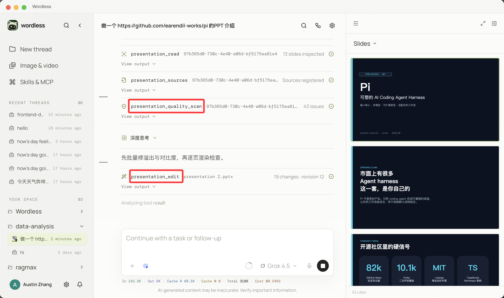

### Spreadsheet

Select a data region in the workbook preview and use that selection as precise context for the next action. Agent changes appear in the workbook immediately instead of remaining as text suggestions.

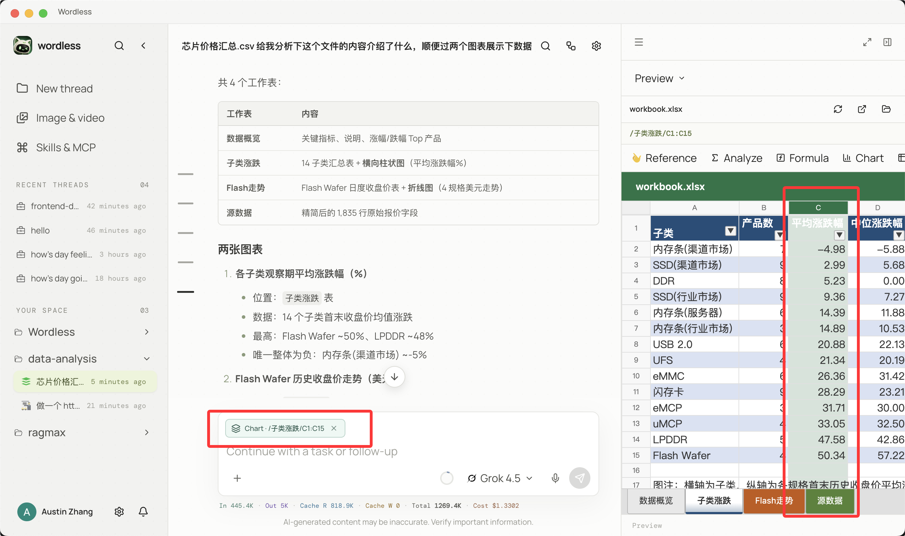

### Data Analysis

Delegate complex research by dimension and distinguish queued, running, completed, and failed work in the timeline, making every researcher's current activity visible.

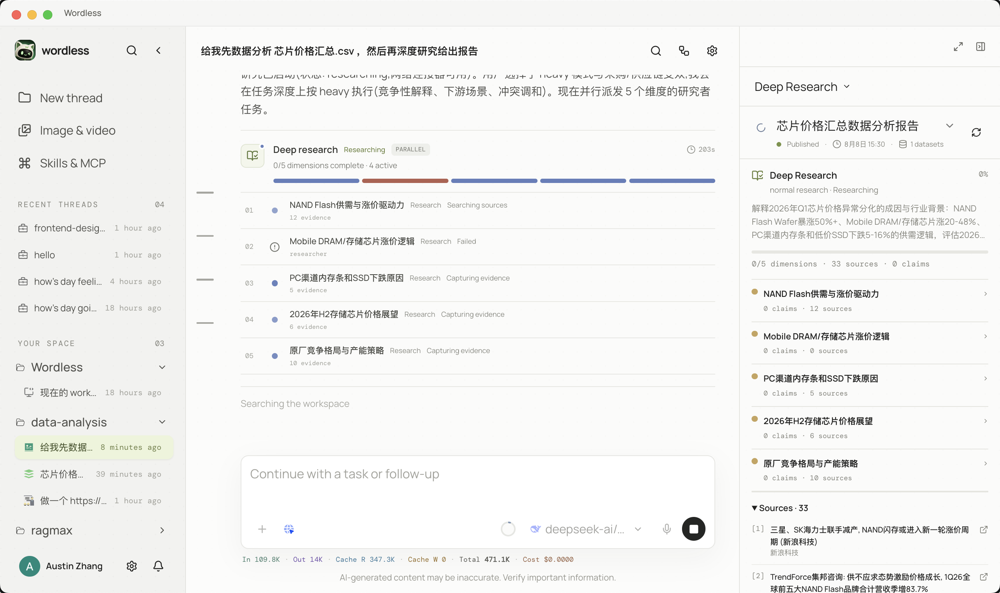

### Coding

Plans, file edits, diffs, and test results remain traceable. Workspace policy governs tool execution, and critical actions enter the approval flow before they occur.

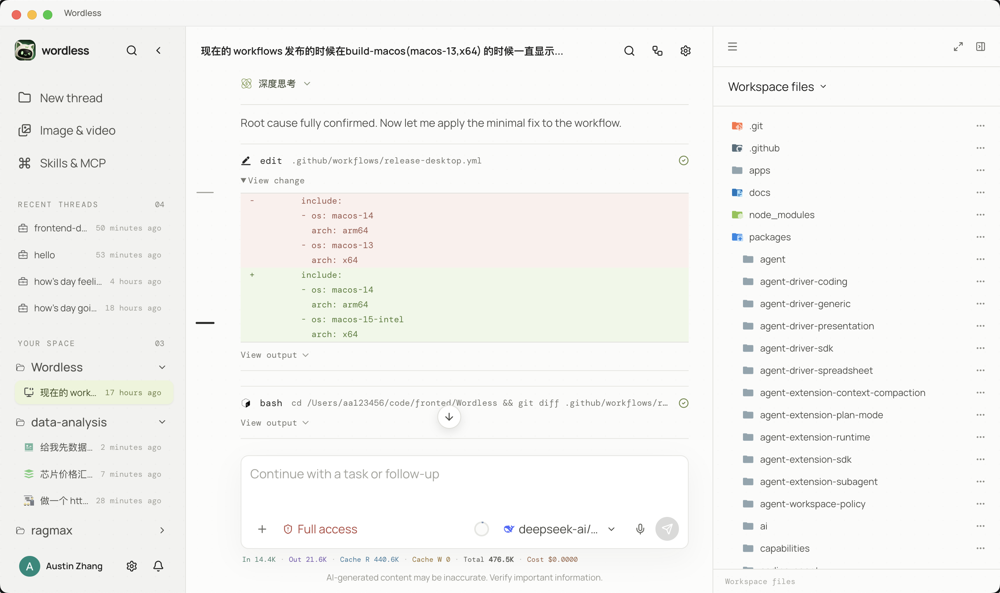

## Extension and control

Skills capture reusable working methods, while MCP connects external capabilities. Model capability and tool permission remain separate: a model can request an action without automatically receiving permission to execute it.

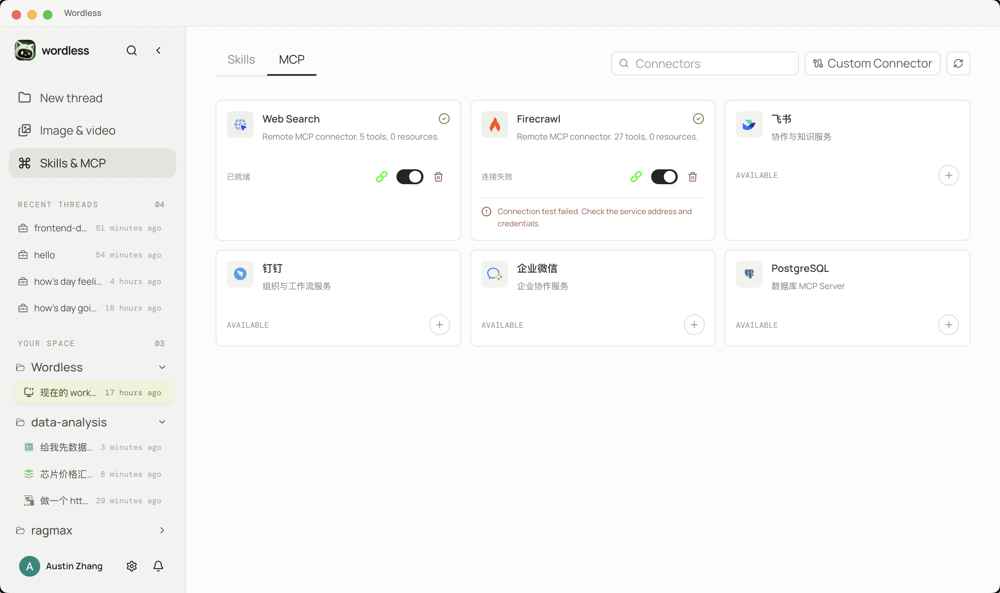

Sensitive credentials such as API keys and OAuth tokens are stored in the operating system's secure credential storage when available. Google cloud sync is disabled by default. When enabled, it only syncs the data types declared in Settings, excluding API keys, workspace files, generated artifacts, and conversation content.

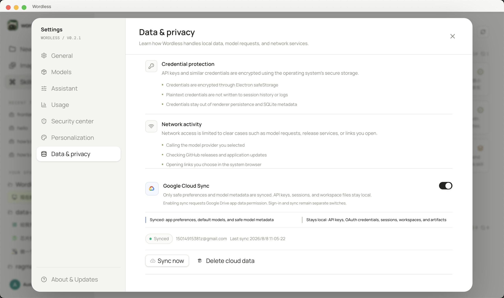

## Architecture

Wordless is a modular monolithic desktop application and does not require a separate local HTTP backend. The React Renderer communicates with Electron Main through a restricted Preload Bridge. The main process composes the Runtime, Agent Profiles, Capabilities, persistence, and platform adapters.

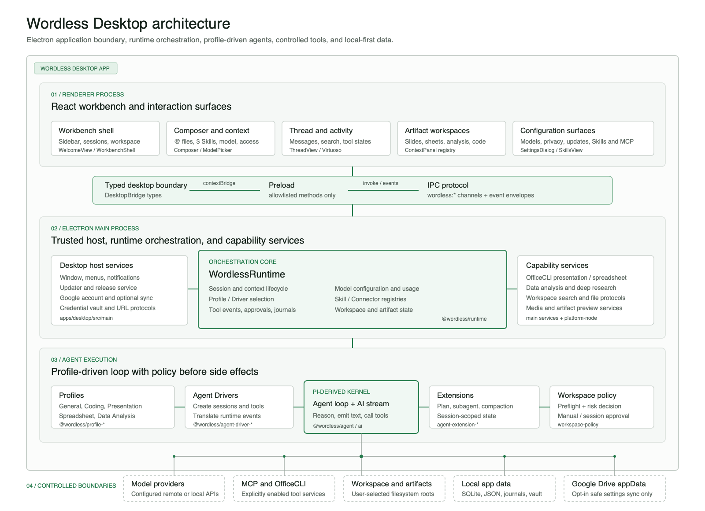

```text
React Renderer
    | validated commands and ordered events
Preload Bridge
    |
Electron Main
    |-- Wordless Runtime
    |     |-- Agent Harness -> AI Provider
    |     |-- Profile Registry -> Profile -> Capabilities
    |     `-- Workspace policy and persistence ports
    |-- JSONL / SQLite adapters
    |-- Node and Office execution adapters
    `-- Credential, window, browser, and notification adapters
```

Work modes are not separate copies of the Agent. Profiles assemble prompts, tools, drivers, and extensions, while the shared Runtime owns sessions, events, approvals, and persistence. Each work mode can evolve independently, and underlying dependencies remain replaceable.

### Kernel boundaries and portability

The product-level Profile mapping above is implemented through explicit dependency boundaries. `@wordless/ai` isolates provider protocols and model capabilities, `@wordless/agent` isolates the loop and event types, and `agent-driver-sdk` defines the contract between Runtime and a concrete kernel. Profiles do not depend directly on Electron, while session journals and domain messages remain owned by Wordless.

| Profile assembly and driver registry | Tool boundaries across work modes |
| --- | --- |
| 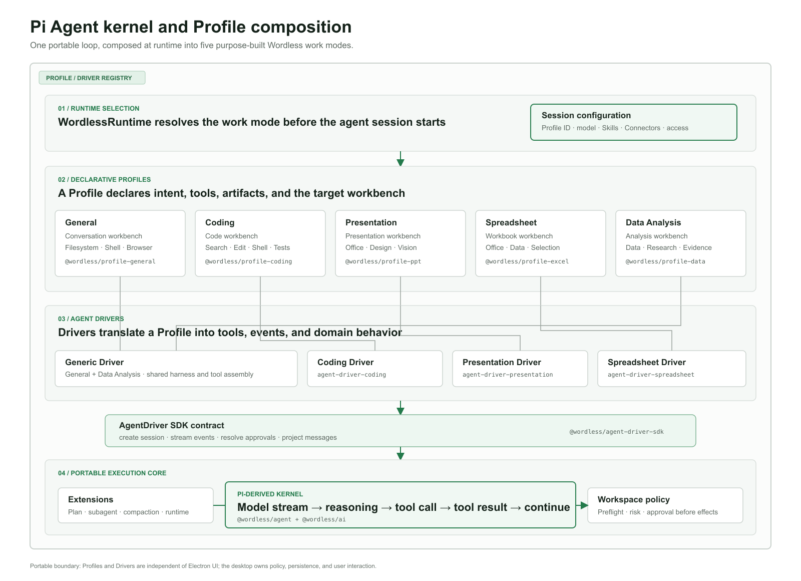 | 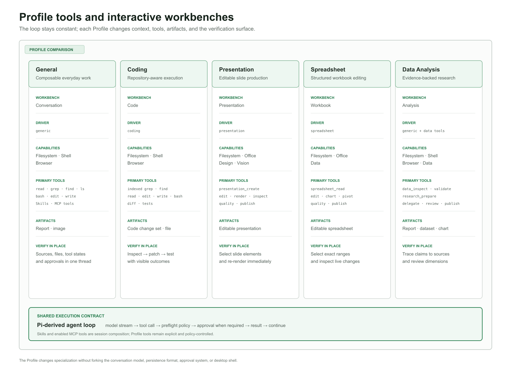 |

Upstream Pi remains credited under its original MIT license. See [Architecture Overview](docs/architecture/overview.md), [Dependency Rules](docs/architecture/dependencies.md), and [Upstream Source Record](UPSTREAM.md) for the detailed boundaries.

## Installation

Download the package for your device from [GitHub Releases](https://github.com/Austin-Patrician/Wordless/releases/latest):

| Device | Installer | Requirement |
| --- | --- | --- |
| Apple Silicon Mac (M1/M2/M3/M4 and later) | `Wordless-<version>-mac-arm64.dmg` | macOS 13 or later |
| Intel Mac | `Wordless-<version>-mac-x64.dmg` | macOS 13 or later |
| Windows 10/11 x64 | `Wordless-<version>-win-x64.exe` | NSIS installer |

Files ending in `.zip`, `.blockmap`, `latest.yml`, and `latest-mac.yml` are primarily used by the update workflow. For a normal installation, choose the `.dmg` or `.exe` file.

> [!IMPORTANT]
> Current macOS releases are test builds without Apple Developer ID notarization. Download them only from the official Wordless repository. On first launch, you may need to Control-click Wordless in Finder and choose **Open**, or use **System Settings → Privacy & Security → Open Anyway**. Do not disable Gatekeeper globally.

Wordless notifies you when a new version is available but never forces installation. Because unsigned macOS builds cannot use the standard signed update path reliably, some versions must be downloaded as a DMG and installed manually over the existing application.

## Model configuration

Wordless does not bundle model credits. Before starting your first task, configure an available provider under **Settings → Models**:

1. Select a built-in provider or create a custom provider.
2. Enter the API key. Credentials are stored separately from ordinary model JSON.
3. For OpenAI-compatible services, enter the Base URL, typically ending in `/v1`, the actual Model ID, and the matching protocol.
4. Enable the model under **Enabled models**, then return to the Composer and select it.
5. If the model declares reasoning support, select a reasoning depth from the chosen model's secondary options. The default is `medium` until changed manually.

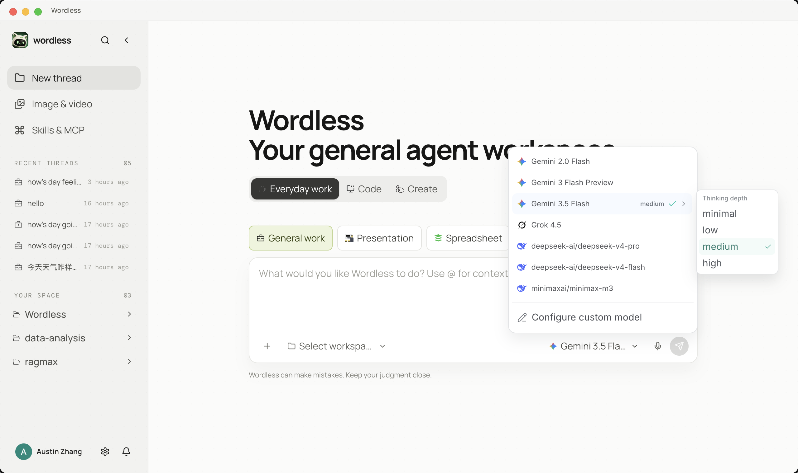

See the [custom model configuration guide](apps/website/src/content/docs/en/docs/models.mdx) for complete field descriptions, JSON examples, and troubleshooting. Always use the provider's own documentation when setting context windows, maximum output, and reasoning parameters.

## Local development

### Requirements

- Node.js `22.19.0` or later
- npm, included with a compatible Node.js release
- macOS 13+ or Windows 10/11 x64 to run the corresponding desktop build

### Start the desktop application

```bash
git clone https://github.com/Austin-Patrician/Wordless.git
cd Wordless
npm ci
npm run dev:electron --workspace=@wordless/desktop
```

The desktop development command prepares the OfficeCLI assets for the current platform, builds the Electron main process, and starts both the Renderer and Electron.

### Common commands

```bash
# Run repository type and static checks
npm run check

# Run Desktop main-process tests
npm run test:host --workspace=@wordless/desktop

# Build Desktop without creating an installer
npm run build:desktop --workspace=@wordless/desktop

# Check and build the Website and user manual
npm run build --workspace=@wordless/website
```

Packaging commands:

```bash
npm run dist:mac --workspace=@wordless/desktop
npm run dist:win --workspace=@wordless/desktop
```

## Monorepo

```text
apps/
  desktop/                         Electron main, Preload, and React Renderer
  website/                         Astro website and bilingual Starlight manual
packages/
  ai, agent/                       Internal fork based on Pi
  runtime, protocol, persistence/  Session orchestration, IPC contracts, persistence
  agent-driver-*/                  General, Coding, Presentation, Spreadsheet drivers
  agent-extension-*/               Compaction, planning, runtime, Subagent extensions
  capabilities/                    Files, Shell, Office, data, browser capabilities
  profiles/                        Built-in work-mode Profiles
  model-config, skill-registry/    Model configuration and Skills registry
  workspace-search/                Workspace search and ignore rules
  ui-kit/                          Shared Renderer state and UI primitives
docs/                              Architecture documentation and README assets
third_party/                       Third-party notices shipped with releases
```

`apps/website` is built and deployed independently and is not packaged into the Desktop installer.

## Data and privacy

- Workspace files, conversations, and artifacts remain local by default.
- Model requests are sent to the provider selected by the user. The transmitted context depends on the task and explicitly referenced material.
- Tools execute in Electron Main or in a user-configured MCP service. The Renderer does not receive direct Node.js access.
- Google sign-in is optional. Google Cloud Sync must be enabled separately, and network failures never block local work.
- Cloud sync currently covers model metadata and user preferences. It excludes API keys, conversation content, workspace files, and generated artifacts.

See [Security & Privacy](apps/website/src/content/docs/en/docs/security-privacy.mdx) for security boundaries and data flows. Do not include API keys, OAuth tokens, private files, or sensitive full logs in public issues.

## Third-party projects

Wordless builds on excellent third-party projects and retains their original licenses and attribution:

- [Pi Agent Harness](https://github.com/earendil-works/pi): upstream source for `packages/ai` and `packages/agent`; see [UPSTREAM.md](UPSTREAM.md).
- [OfficeCLI](https://github.com/iOfficeAI/OfficeCLI): Presentation and Office document engine.
- [Electron](https://github.com/electron/electron), [React](https://github.com/facebook/react), and [Vite](https://github.com/vitejs/vite): desktop and frontend foundations.
- [React Virtuoso](https://github.com/petyosi/react-virtuoso): virtualization for long conversations.
- [Astro](https://github.com/withastro/astro) and [Starlight](https://github.com/withastro/starlight): website and user manual.
- [Three.js](https://github.com/mrdoob/three.js): 3D visuals on the Website.

Third-party components are not relicensed under the Wordless custom license. They remain subject to the licenses in their own repositories or accompanying files.

## Contributing

Reproducible bug reports, feature proposals, documentation feedback, and pull requests are welcome through [GitHub Issues](https://github.com/Austin-Patrician/Wordless/issues). Run checks and tests appropriate to your change before submitting, and never commit credentials, personal data, build artifacts, or workspace content.

## License and commercial use

Original Wordless code and assets are licensed under the [Wordless Source-Available License 1.0](LICENSE). Personal, educational, research, evaluation, and non-commercial internal use is free. Commercial use, paid services, SaaS, resale, commercial hosting, or revenue-related distribution requires prior written authorization.

This is a **source-available license, not an OSI-approved open-source license**. For commercial licensing, contact the maintainers through [GitHub Issues](https://github.com/Austin-Patrician/Wordless/issues) without disclosing confidential business information. Third-party and upstream code remains subject to its original licenses.

## Star History

<a href="https://www.star-history.com/#Austin-Patrician/Wordless&amp;Date">
  <picture>
    <source media="(prefers-color-scheme: dark)" srcset="https://api.star-history.com/svg?repos=Austin-Patrician/Wordless&amp;type=Date&amp;theme=dark" />
    <source media="(prefers-color-scheme: light)" srcset="https://api.star-history.com/svg?repos=Austin-Patrician/Wordless&amp;type=Date" />
    
  </picture>
</a>

## Community & Support

<table>
  <tr>
    <td align="center" width="50%">
      <a href="https://qr.wordless.20250230.xyz/wechat-group.png">
        
      </a>
      <br />
      <strong>Join the Wordless WeChat group</strong>
      <br />
      <sub>Share product feedback, questions, and Agent workflows</sub>
    </td>
    <td align="center" width="50%">
      <a href="https://qr.wordless.20250230.xyz/buy-me-coffee.png">
        
      </a>
      <br />
      <strong>Buy Me a Coffee</strong>
      <br />
      <sub>Support the continued development and maintenance of Wordless</sub>
    </td>
  </tr>
</table>

---

Finally, thank you to everyone at LinuxDo for supporting Wordless. Join [https://linux.do/](https://linux.do/) for technical discussions, frontier AI news, and practical AI experience sharing.
