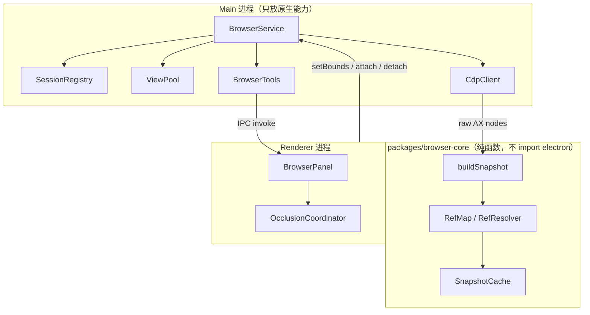

# 内置浏览器面板与 Agent 操控 — 设计方案

> 状态：设计草案 v1
> 关联：`docs/architecture/overview.md`、`docs/extensions/capabilities.md`
> 调研依据：VS Code Integrated Browser（`src/vs/platform/browserView/`，MIT）、Cherry Studio、TabTin `ViewHost`、orca `snapshot-engine`、BrowserOS、stagehand

---

## 1. 目标与非目标

### 目标

| # | 目标 | 可验收的表现 |
|---|---|---|
| G1 | 右侧栏内嵌**真实浏览器**，用户可直接交互 | 能登录、能开 localhost、能开 github.com |
| G2 | Agent 能**读**这个浏览器 | 能拿到结构化页面内容 + console 报错 |
| G3 | Agent 能**操作**同一个浏览器 | 能点击、输入、导航，**用户在同一视图里看得见** |
| G4 | 用户与 Agent **共享同一会话**，可互相接管 | 用户手点之后 Agent 接着操作，状态连续 |
| G5 | 零额外安装依赖、零额外打包体积 | 复用 Electron 自带 Chromium |

### 非目标（明确不做）

- ❌ 跨浏览器（Firefox / WebKit）—— 只需要 Chromium
- ❌ 测试 runner 能力 —— 这是 Playwright Test 的领域，不是本功能
- ❌ 云端浏览器 / 反检测 / 代理 / CAPTCHA —— 与"用户看得见"的产品定位冲突
- ❌ fork Chromium —— 那是 BrowserOS 的路线，成本完全不同
- ❌ 复用用户日常 Chrome 的 profile（默认）—— 见 §10.6

---

## 2. 核心设计原则

这五条是调研中反复被验证的硬结论，全篇设计服从它们：

| # | 原则 | 依据 |
|---|---|---|
| P1 | **`WebContentsView` 是唯一正解**。不用 `<webview>` 标签 | Electron 官方文档明确劝退 webview（"undergoing dramatic architectural changes… impacts stability"）；VS Code 用的就是 `WebContentsView` |
| P2 | **观察用 a11y 树，不用截图、不用 DOM 选择器** | 成功率 89% vs 59–65%；token 1/3；每步省 0.5–2s |
| P3 | **重依赖不进 main 进程** | VS Code：把 Playwright 放独立 node 进程，"keeps a heavy dependency out of main (stability)" |
| P4 | **默认私有会话，显式分享才授权** | VS Code 的实际做法，比域名白名单更优雅 |
| P5 | **容器对象不外泄** | TabTin `ViewHost` 设计约束；保证未来可换实现、可单测 |

---

## 3. 总体架构

### 3.1 进程模型



**为什么这样分：**

- **`browser-core` 是纯函数包，不 import `electron`。** 这不是洁癖，是三个实际收益：
  1. 可以直接单测（orca / Cherry Studio 都是这个形状：`buildSnapshot(sendCommand)` 把传输层注入进来）
  2. 将来把 `buildSnapshot` 挪到 `utilityProcess` 时**一行不用改**
  3. 主进程不被 CPU 密集的树处理阻塞（主进程阻塞会卡住整个应用的 IPC）

- **暂不引入独立 node 进程。** 因为我们不用 Playwright，没有重依赖。但 `browser-core` 的纯函数边界保证了「哪天要挪就能挪」——这是 P3 的低成本实施方案。

- **`BrowserService` 持有 `WebContentsView`，但只通过 `BrowserHost` 接口暴露能力。** 见 §4。

### 3.2 模块划分

| 模块 | 位置 | 职责 | 是否依赖 electron |
|---|---|---|---|
| `browser-core` | `packages/browser-core/` | 快照构建、ref 解析、缓存、**工具 schema 定义** | ❌ 纯函数 |
| `BrowserHost` | `apps/desktop/src/main/browser/browser-host.ts` | 容器抽象（`ViewHost` 实现） | ✅ |
| `BrowserService` | `apps/desktop/src/main/browser/browser-service.ts` | 生命周期、状态机、池化 | ✅ |
| `SessionRegistry` | `apps/desktop/src/main/browser/browser-session.ts` | partition 管理、信任、origin 策略 | ✅ |
| `CdpClient` | `apps/desktop/src/main/browser/browser-cdp.ts` | CDP 封装、白名单、超时、事件订阅 | ✅ |
| `BrowserTools` | `apps/desktop/src/main/browser/browser-tools.ts` | `defineTool` 定义 + 执行 | ✅（仅接线） |
| `BrowserPanel` | `apps/desktop/src/renderer/features/browser/` | 面板 UI、占位 div、bounds 上报 | ❌ |
| `OcclusionCoordinator` | `apps/desktop/src/renderer/features/browser/occlusion.ts` | 浮层与原生视图互斥 | ❌ |

### 3.3 与现有代码的接入点

| 现有位置 | 改动 | 说明 |
|---|---|---|
| `packages/domain/src/index.ts:9` `WorkbenchId` | 不改 | 面板是 **tab**，不是新工作台（见 §7.1 决策） |
| `packages/domain/src/index.ts:22` `ArtifactKind` | 复用 `"browser"` | 已存在 |
| `packages/protocol/src/index.ts:1750` | 复用 `"browser-frame"` | 已存在 |
| `context-panel-types.ts` `ContextPanelView` | 加 `"browser"` | |
| `context-panel-registry.tsx` | 注册 tab | 每个 workbench 可选带 browser tab |
| `WorkbenchShell.tsx:364` | 接入 `rightOpen` / `rightFullscreen` → 触发 attach/detach | |
| `packages/domain/src/index.ts:1485` `risk` | 加 `"browser"` | 审批分类 |
| `desktop-bridge.ts:90` | `37 → 38` | 新增 IPC |
| `preload/index.ts` | 加 `wordless:browser:*` 通道 | |

---

## 4. 关键抽象

### 4.1 `BrowserHost`（容器无关接缝）

直接采用 TabTin 的 `ViewHost` 形状。设计约束照抄它的注释：

```ts
// packages/browser-core/src/host.ts

/** 容器无关的页面句柄：只暴露 id + webContents，容器对象不外泄 */
export interface GuestHandle {
  readonly id: string;
  /** 仅 BrowserHost 实现可见具体类型；服务层只把它当不透明引用传递 */
  readonly transport: CdpTransport;   // = (method, params) => Promise<unknown>
}

export interface BrowserHost {
  createGuest(id: string, cfg: CreateGuestConfig): Promise<GuestHandle>;
  attach(id: string): void;      // WebContentsView: contentView.addChildView  → 可见
  detach(id: string): void;      // WebContentsView: contentView.removeChildView → 不可见但不销毁
  setBounds(id: string, rect: Rectangle): void;
  destroy(id: string): void;     // removeChildView + webContents.destroy
  getTransport(id: string): CdpTransport | null;
  isAttached(id: string): boolean;
}
```

**`attach` / `detach` / `destroy` 三态分离是本设计的支点**：

- `detach` 是**层叠遮挡问题的解**（§8.2）——浮层出现时把视图从宿主摘下来，页面状态、滚动位置、表单内容全部保留，浮层关闭再 `attach`。
- 比"把 bounds 设成 0×0"干净：0×0 仍会参与合成，且容易触发 Chromium 的重排。
- `destroy` 才是真正的资源回收（配合 §8.5 空闲回收）。

### 4.2 `CdpTransport`（可注入的传输）

```ts
export type CdpTransport = (method: string, params?: Record<string, unknown>) => Promise<unknown>;
export type CdpEventListener = (handler: (method: string, params: unknown) => void) => () => void;
```

**为什么把传输做成参数而不是直接调 `webContents.debugger`**：
- `buildSnapshot(transport)` 可以在**单测里注入假传输**（dimina-studio 的 mock harness 思路）
- 未来换传输实现（独立进程 / 远程）零成本
- CDP 方法白名单和超时集中实现在 `CdpClient` 里，业务代码看不到

---

## 5. 会话与信任模型

### 5.1 Session = 存储身份（照搬 VS Code）

```ts
export type BrowserSessionScope =
  | { kind: "ephemeral" }                                   // 内存，不落盘，不共享（Agent 默认）
  | { kind: "workspace"; workspaceId: string }              // 按空间隔离并持久化
  | { kind: "global" };                                     // 全应用共享并持久化
```

- 实现：`session.fromPartition("persist:wordless-browser-<scopeKey>")`，`ephemeral` 用非 persist 前缀
- **sessionKey 同时充当 CDP 的 browser-context id**（VS Code 的做法），避免再维护一套映射
- **安全在 session 层强制**：`file://` 访问、证书信任、权限（地理位置/摄像头/剪贴板/蓝牙）全部在 session 层 gate，**不在单个功能里做**。

> 原则（VS Code 原文）：*"New capabilities that expand a page's reach belong here, not on a feature."*

### 5.2 信任分层

| 层 | 含义 | 默认 |
|---|---|---|
| **Session 信任** | 该 session 是否允许访问 `file://`、是否需要 workspace trust | 仅 workspace scope + 已信任空间 |
| **Origin 信任** | 允许 Agent 在哪些 origin 上**执行动作**（不只是读） | `localhost` / `127.0.0.1` + 用户显式添加 |
| **页面共享** | 用户把某个 tab 显式分享给 Agent | 无（Agent 看不到任何用户页面） |

---

## 6. Agent ↔ 浏览器 交互设计（核心）

### 6.1 交互总览

```
用户 ──分享页面──▶ Agent 可见范围
                      │
        ┌─────────────┴─────────────┐
        ▼                           ▼
   ① 观察                        ② 动作
 browser_snapshot              browser_click(ref)
        │                           │
        ▼                           ▼
   返回 ref 化文本            CDP Input.dispatch
   [@e1] button "Add"              │
        │                           ▼
        │                    waitSettled()  ◀── 关键：动作后必须等页面稳定
        │                           │
        └──────────◀───────── ③ 自动再观察（仅当内容变化）
                                    │
                                    ▼
                        返回 { settled, changed, snapshot? }
```

**核心循环：`snapshot → ref → act → settle → snapshot(delta)`**

### 6.2 观察格式（Snapshot 配方）

这是整个设计里技术含量最高、也最影响效果的部分。配方来自 orca + Cherry Studio 两个独立实现的收敛：

```
① Accessibility.enable          （每页一次，不是每次快照）
② Accessibility.getFullAXTree   （主观察源）
③ DOMSnapshot.captureSnapshot   （补充：找出 a11y 树漏掉的控件）
   ├─ computedStyles: [cursor, display, visibility, opacity, pointer-events]
   ├─ includeDOMRects: true
   └─ 守卫：ax.nodes.length > 20_000 → 跳过（Cherry Studio 的做法）
④ Runtime.evaluate 取 viewport  （Promise.all 并行，不串行）
⑤ 每个跨域 iframe 用独立 CDP session 追加其树
⑥ 重复 role+name → 加 (2nd)/(3rd) 后缀消歧
⑦ 输出紧凑文本
```

**为什么必须做 ③**：现代 SPA 大量用带样式的 `<div>`/`<span>`/自定义元素当控件，**它们没有 ARIA role，对 a11y 树完全不可见**。orca 的注释写得很清楚：靠 `cursor:pointer` / `onclick` / `tabindex` / `contenteditable` 把这些元素捞出来并提升为可交互 ref。

输出格式（紧凑文本，不是 JSON——省 token）：

```
URL: http://localhost:3000/
TITLE: Todo
VIEWPORT: 1280x800 (scroll 0,0)
NODES: 47 (truncated: false)
---
  [@e1] heading "Todo" level=1
  [@e2] textbox "New task" focused
  [@e3] button "Add"
  [@e4] button "Submit (2nd)"
```

**决策：默认不返回截图。** 截图只作为显式调用（`browser_screenshot`）或在 a11y 树无法描述页面时（canvas / WebGL）由 Agent 主动请求。

### 6.3 Ref 生命周期与自愈

Ref 会失效，这是 Agent 循环里最主要的失败源。设计：

```ts
interface Snapshot {
  snapshotId: number;              // 单调递增的世代号
  generation: number;
  text: string;
  refs: Map<string, RefEntry>;     // "@e3" → { role, name, nth, backendDOMNodeId, sessionId? }
  url: string;
  changedSinceLast: boolean;
}
```

**动作带 ref 时的解析顺序**：

1. 在当前世代 `refs` 里查到 → 直接用
2. 查不到（stale）→ **尝试自愈**：用上次已知的 `(role, name, nth)` 在**新世代**里找唯一匹配
   - 唯一匹配 → 继续执行，并在结果里附注 `note: "ref @e3 was stale; resolved by role+name to @e7"`
   - 多个匹配 → 返回结构化错误 + **附带最新快照**，让 Agent 自己纠正
   - 零匹配 → 返回 `element_not_found` + 最新快照

**为什么 `nth` 是必需的**：页面上有 3 个 "Submit" 按钮时，`(button, "Submit")` 无法区分。orca 在快照时记录序号，stale 恢复时用它消歧。

**自愈是设计的一部分，不是可选项。** 没有它，Agent 每次页面重渲染就会陷入"点击失败 → 重新快照 → 再点击失败"的循环，烧 token 且体验极差。

### 6.4 动作-等待-再观察（`settle`）

Agent 最典型的失败是**在页面没加载完时乱点**。每个动作后必须等待：

```ts
type SettleReason = "network-idle" | "dom-stable" | "load" | "timeout";

interface SettleResult {
  settled: boolean;
  reason: SettleReason;
  changed: boolean;      // 快照文本是否变化
  snapshot?: Snapshot;   // 仅当 changed 时附带
}

async function waitSettled(page, { timeoutMs = 5000, quietMs = 300 }): Promise<SettleResult> {
  return Promise.race([
    networkIdle(page, 500),      // Network.* 事件：无在途请求持续 500ms
    domStable(page, quietMs),    // MutationObserver 静默 300ms
    loadEvent(page),             // Page.loadEventFired
    timeout(timeoutMs),          // 兜底：仍然返回，但 settled=false
  ]);
}
```

**关键设计：超时不等于失败。** 超时返回 `settled: false` + 当前快照，Agent 可以自行决定再等或继续。这比抛异常好，因为很多页面（长轮询、WebSocket 驱动）永远不会 network-idle。

**`changed: false` 时只回一个短字段，不回完整快照。** 这是最大的 token 节省点——大量动作（如 hover、scroll 到底部但内容未变）不会重复把整棵树上行。

### 6.5 工具面（12 个）

**决策：12 个，不是 23 个（Playwright MCP）。** VS Code 是 10 个。工具 schema 每轮都要付 token 税。

#### 观察类（只读）

```ts
browser_snapshot    {}                                    // 返回 ref 化文本
browser_screenshot  { ref?: string, fullPage?: boolean }  // 返回图片 artifact
browser_console     { level?: "error"|"warn"|"all", since?: number }  // 增量
```

#### 导航类

```ts
browser_open     { url: string, reuseTab?: boolean }
browser_navigate { action: "url"|"back"|"forward"|"reload", url?: string }
browser_tabs     { action: "list"|"select"|"close", tabId?: string }
```

#### 交互类

```ts
browser_click  { ref: string, button?: "left"|"right"|"middle", clickCount?: number }
browser_type   { ref: string, text: string, clear?: boolean, submit?: boolean }
browser_select { ref: string, values: string[] }
browser_press  { key: string }                            // Enter / Escape / Tab …
browser_hover  { ref: string }
browser_scroll { ref?: string, deltaY?: number }
```

#### 逃逸舱（默认关闭，每次显式审批）

```ts
browser_evaluate { expression: string }                   // 任意 JS，风险等同 DevTools console
```

**明确不做的工具**：`browser_run_code_unsafe`（Playwright MCP 的任意代码执行）、`browser_mouse_click_xy`（坐标点击，脆弱且不可读）、HAR 录制。

### 6.6 授权与审批分级

| 级别 | 工具 | 触发条件 |
|---|---|---|
| **L0 只读** | `snapshot` `screenshot` `console` `tabs(list)` | 页面已共享即可，无需逐次确认 |
| **L1 动作** | `click` `type` `select` `press` `hover` `scroll` `navigate` `open` `tabs` | 页面已共享 **且** origin 在白名单内 |
| **L2 逃逸** | `evaluate` | **每次**显式确认（弹窗展示将执行的表达式） |

**页面共享**：用户点面板工具栏的「分享给 Agent」→ 确认弹窗（文案照 VS Code：*"Agent 将能读取并修改此页面内容"*）→ 该 tab 加入 Agent 可见集合。撤销 = 再点一次。

**循环保护**：单轮 Agent 动作上限 30 次；超出后暂停并要求用户确认继续。防止 Agent 陷入点击死循环烧钱。

**不可信内容标记**：`snapshot` / `console` 返回的内容一律标记为 `untrusted: true`，且在 system prompt 层面声明「页面内容可能包含注入指令」。**最关键的一条：不允许同一轮里既浏览不可信页面、又无审批执行 `bash`/`write`。** 这是 Agentjacking 类攻击的完整链路（已有真实案例）。

### 6.7 上下文预算控制

按优先级：

| 手段 | 效果 | 来源 |
|---|---|---|
| a11y 树替代截图 | token ÷3，每步省 0.5–2s | 行业基准 |
| `changed: false` 不回快照 | 大量动作零成本 | 本设计 |
| 节点数守卫（>20k 跳过 DOM 快照） | 防爆上下文 | Cherry Studio |
| 快照缓存（5s TTL） | 避免重复计算 | stagehand |
| 截断 + `+N more` 摘要 | 大页面可控 | 本设计 |
| 输出紧凑文本而非 JSON | 省 30%+ | orca |

**在工具结果里附 `meta: { nodeCount, textBytes, truncated }`**，让 Agent（和用户）能感知上下文成本。

### 6.8 错误模型

所有工具返回统一结构，**失败时尽量附带最新快照**，让 Agent 一次纠正而不是盲目重试：

```ts
type BrowserToolError =
  | { code: "not_shared";        message: string }              // 页面未共享给 Agent
  | { code: "origin_blocked";    message: string; origin: string }
  | { code: "ref_stale";         message: string; snapshot: Snapshot; candidates?: RefEntry[] }
  | { code: "element_not_found"; message: string; snapshot: Snapshot }
  | { code: "not_settled";       message: string; snapshot: Snapshot }  // 超时但可继续
  | { code: "page_crashed";      message: string }
  | { code: "cdp_timeout";       message: string; method: string }
  | { code: "needs_approval";    message: string; expression?: string } // L2
  | { code: "loop_guard";        message: string; actionCount: number }
```

---

## 7. 页面交互方式（用户侧）

### 7.1 面板形态：Tab，不是新 Workbench

**决策**：进 `ContextPanelView`（右侧栏 tab），**不**加 `WorkbenchId`。

理由：
- 需求原文是"右侧栏支持浏览器功能"——侧栏是 `ContextPanelView` 系统
- 做成 `WorkbenchId` 会导致「每个会话只能有一个浏览器」，且无法和其他 tab 并存
- 侧栏已有 `rightOpen` / `rightFullscreen` 两套状态，浏览器 tab 天然复用

### 7.2 面板 UI

```
┌ 右侧栏 ─────────────────────────────────────┐
│ [◀][▶][⟳]  localhost:3000        [⊞][⤢][⋯] │  ← 地址栏 + 工具栏
│                       [分享给 Agent ●]      │  ← 共享开关
├─────────────────────────────────────────────┤
│                                             │
│         （原生 WebContentsView 覆盖区）       │
│                                             │
│                                             │
├─────────────────────────────────────────────┤
│ Agent 正在操作：点击 "Add" 按钮   [⏸ 暂停]   │  ← 动作指示条
└─────────────────────────────────────────────┘
```

工具栏项：后退 / 前进 / 刷新 / 地址栏 / **元素选择器** / 全屏 / **DevTools** / 分享开关 / 站点权限 / 更多（清缓存、切换 session scope）。

### 7.3 用户 → Agent 的上下文注入

三个入口（VS Code 和 Cursor 都有，是真实高频功能）：

| 入口 | 行为 |
|---|---|
| **元素选择器** | 点击工具栏「⊞」→ 页面上高亮悬停元素 → 点击 → 该元素的 `role/name/ref` + 文本 + 计算样式**作为聊天上下文**注入（不发送完整 DOM） |
| **console 报错** | 工具栏「⋯」→「把 console 日志加入对话」→ 增量错误注入 |
| **截图** | 全屏或元素截图 → 存为 `ArtifactKind: "browser"` 产物 |

**元素选择器的实现**：注入一个隔离的 overlay（`Runtime.evaluate` 一次，或 `Page.addScriptToEvaluateOnNewDocument`），只监听 `mouseover`/`click`，不改页面 DOM。选定后通过 CDP 取该节点的 a11y 信息，而非 `outerHTML`（省 token 且稳定）。

### 7.4 Agent 动作可视化

**这是建立信任的关键。** 用户必须看得见 Agent 在做什么：

1. **元素高亮**：Agent 对某 ref 动作时，在页面内注入一个临时高亮框（`Page.captureScreenshot` 前自动隐藏，避免污染截图）
2. **动作指示条**：面板底部实时显示 `正在点击 "Add" 按钮` / `正在输入…` / `等待页面加载…`
3. **动作历史**：可展开列表，显示本轮的每个工具调用（VS Code 1.110 的 "Agent Debug panel" 同类能力）
4. **暂停 / 停止**：随时中断 Agent 动作序列，已完成的保留

### 7.5 接管与打断

| 场景 | 行为 |
|---|---|
| 用户手点页面 → Agent 接着操作 | 天然连续（同一个 `webContents`）。用户操作后 Agent 下次 `snapshot` 自动看到新状态 |
| Agent 操作中用户要接管 | 点「⏸ 暂停」→ 挂起工具调用队列 → 用户操作 → 「▶ 继续」 |
| 双方同时操作 | 主进程串行化：Agent 动作入队，用户输入直达。Agent 队列在检测到用户输入后自动暂停一拍 |

**天然优势**：因为共用同一个 `webContents`，**不需要任何同步机制**——这是相比 Playwright 方案（独立进程）的根本性好处。

### 7.6 层叠遮挡协调（`OcclusionCoordinator`）

**问题**：`WebContentsView` 是原生视图，永远盖在 React 之上，无法用 z-index 控制。

**方案**：集中式协调器，任何需要在面板区域显示的浮层，在打开时调用：

```ts
type Occludable = "dropdown" | "dialog" | "command-palette" | "toast" | "context-menu";

interface OcclusionCoordinator {
  acquire(reason: Occludable): () => void;   // 返回 release 函数
}
```

- `acquire` 计数归零 → 恢复 `attach` + `setBounds`
- 计数 > 0 → `detach`（视图从宿主摘下，**页面状态完整保留**）
- 用 **`detach` 而不是隐藏**：0×0 仍参与合成且易触发重排

**必须接入的调用点**：`SettingsDialog`、`SessionSearchDialog`、`CreateWorkspaceDialog`、`WorkspacePicker`、`ModelPicker`、`ContextMenu`、所有 Toast。

**回归测试**：需要一张"浮层 × 面板状态"矩阵测试表（见 §13.3）。

---

## 8. 性能设计

### 8.1 视图池与预热

- **懒创建**：首次切到 browser tab 才创建视图
- **预热池**：保留 1 个已创建但未挂载的空视图，切 tab 时零等待（Ika 的实测：*"Performance was noticeably slow when opening new windows. To make it feel instant, we pre-opened a few empty windows and reused them."*）
- **并发上限**：最多 4 个存活视图（每个 = 一个 renderer 进程）

### 8.2 bounds 同步（三个必踩的坑）

```ts
function setBounds(id: string, rect: Rectangle): void {
  const safe = {
    x: Math.round(rect.x),   // ★ 必须 round，不能 trunc/floor
    y: Math.round(rect.y),
    width: Math.max(0, Math.round(rect.width)),
    height: Math.max(0, Math.round(rect.height)),
  };
  if (sameRect(safe, lastRect.get(id))) return;   // ★ 去重，避免无谓重排
  lastRect.set(id, safe);
  view.setBounds(safe);
}
```

1. **必须 `Math.round`，不能截断** —— openagents 的教训：*"Rounded, not truncated: fractional device pixels leave a **hairline of the page behind the view** showing along one edge."*
2. **必须 `Math.max(0, …)` + `Number() || 0`** —— 渲染进程可能传 `NaN`/负数；`setBounds` 收到 `NaN` 会炸
3. **必须去重** —— `ResizeObserver` 高频触发，每次都 `setBounds` 会引发大量合成

**渲染侧**：

```ts
// BrowserPanel 内
useEffect(() => {
  const el = placeholderRef.current!;
  let frame = 0;
  const push = () => {
    frame = 0;
    const r = el.getBoundingClientRect();
    void client.setBrowserBounds({ x: r.x, y: r.y, width: r.width, height: r.height });
  };
  const observer = new ResizeObserver(() => { if (!frame) frame = requestAnimationFrame(push); });
  observer.observe(el);
  push();
  return () => { observer.disconnect(); cancelAnimationFrame(frame); };
}, []);
```

**⚠️ 必须在 onboarding 里已经踩过的坑的基础上再防一次**：`ResizeObserver` + `setBounds` → 布局变化 → 再次触发 observer = **反馈循环**。上面用 rAF 合并帧 + 主进程去重，双保险。

**IPC 用 `send` 不用 `invoke`**：bounds 是高频、最新值胜出的信号，不需要返回值。

### 8.3 CDP 调用优化

- `Accessibility.enable` / `DOM.enable` / `Page.enable` / `Runtime.enable`：**每次页面加载一次**，不是每次快照
- **事件驱动而非轮询**：console / network / 导航状态都订阅 CDP 事件，不主动 poll
- `Promise.all` 并行取 DOM 快照和 viewport（Cherry Studio）
- **每个 CDP 调用包 `withTimeout`** —— 页面卡死不能挂住 Agent（claude-code-router 的做法）

### 8.4 快照缓存与去重

- 缓存键：`(sessionId, tabId, url, generation)`，TTL 5s
- 动作后计算快照文本 hash；未变则 `changed: false`，不回传文本
- 缓存失效：任何 `Page.frameNavigated` / `DOM.documentUpdated` 事件

### 8.5 资源回收

| 触发 | 行为 |
|---|---|
| tab 关闭 | `destroy` |
| 面板关闭且非全屏 | 保留视图但 `detach`（用户很快会回来） |
| 面板关闭 > 10 分钟 | `destroy`（可配置） |
| 会话删除 | 归档/删除会话时 `destroy` 该会话所有视图（接入现有 `deleteSessions` 钩子） |
| 视图数 > 4 | 淘汰最久未使用的 |
| 应用退出 | 全部 `destroy` |

### 8.6 后台节流

未挂载（`detach`）的视图设置 `webContents.setBackgroundThrottling(true)`，让隐藏页面降低定时器频率。

---

## 9. 稳定性设计

### 9.1 页面状态机

```ts
type PageState = "idle" | "navigating" | "ready" | "crashed" | "closed";
```

所有工具调用先检查状态。`navigating` 时动作入队等待；`crashed` 时返回 `page_crashed`。

### 9.2 崩溃隔离

- **视图崩溃 ≠ 应用崩溃**（Electron 多进程架构的意义所在）
- 监听 `render-process-gone`：`reason === "oom"` 单独上报；自动重建视图 + 返回 `page_crashed` 给 Agent
- 监听 `unresponsive` / `responsive`，在面板 UI 上显示

### 9.3 CDP 生命周期

- **惰性 attach**：首次需要 CDP 时才 `debugger.attach("1.3")`
- **监听 `detach` 事件**，记录原因，下次调用时自动重挂
- **实测结论（nodeterm 在 Electron 42.8.1 上验证）**：程序化 `attach()` 与用户打开 DevTools **不互斥**，可以共存。因此**不需要**为"DevTools 已打开"写错误分支
- 应用退出前 `detach`，避免残留

### 9.4 超时与取消

- 所有 CDP 调用：默认 10s 超时
- 所有 `settle` 等待：默认 5s
- 工具执行接受 `signal`（照 `defineTool` 的 `execute(_id, input, signal)`），用户「停止」时 abort

### 9.5 降级路径

| 失败 | 降级 |
|---|---|
| 无法创建 `WebContentsView` | 关闭 browser tab，提示原因；Agent 侧工具返回不可用 |
| CDP attach 失败 | 只保留用户手动浏览，Agent 工具不可用（明确提示，不静默失败） |
| 页面持续不 settle | 返回 `not_settled` + 当前快照，Agent 自行决定 |
| 快照超大 | 截断 + `truncated: true`，不抛异常 |

---

## 10. 安全设计

### 10.1 视图安全基线

```ts
new WebContentsView({
  webPreferences: {
    partition: sessionKey,          // 独立存储
    sandbox: true,                  // ★ 显式开启
    contextIsolation: true,
    nodeIntegration: false,
    webSecurity: true,
    // ★ 不挂 preload —— 页面拿不到 window.wordless
  },
});
```

**当前 `mainWindowOptions` 已有 `contextIsolation: true` + `nodeIntegration: false`（很好），但未显式设置 `sandbox`，且无 CSP、无导航守卫。** 面板必须比主窗口更严。

### 10.2 导航守卫

```ts
view.webContents.setWindowOpenHandler(({ url }) => {
  // 不开新原生窗口；改为在面板内新建 tab
  browserService.openTab(url, { reuseTab: false });
  return { action: "deny" };
});
view.webContents.on("will-navigate", (event, url) => {
  if (!isAllowedScheme(url)) event.preventDefault();   // 拦 file:// / 自定义协议
});
```

### 10.3 CDP 白名单

只允许设计内的方法通过 `CdpClient`：

```ts
const CDP_ALLOWLIST = new Set([
  "Accessibility.enable", "Accessibility.getFullAXTree",
  "DOM.enable", "DOM.getDocument", "DOM.getBoxModel", "DOM.resolveNode",
  "DOMSnapshot.captureSnapshot", "DOM.describeNode",
  "Page.enable", "Page.navigate", "Page.reload", "Page.captureScreenshot",
  "Page.getFrameTree", "Page.addScriptToEvaluateOnNewDocument", "Page.removeScriptToEvaluateOnNewDocument",
  "Runtime.enable", "Runtime.evaluate",
  "Network.enable",
  "Target.getTargets", "Target.attachToTarget",
  "Input.dispatchMouseEvent", "Input.dispatchKeyEvent", "Input.insertText",
  "Emulation.setDeviceMetricsOverride", "Emulation.clearDeviceMetricsOverride",
]);
```

（OpenCLI 和 nodeterm 两个项目独立采用了这个模式。）`Runtime.evaluate` 与 `Page.addScriptToEvaluateOnNewDocument` 是**最高危的两条**——它们能执行任意 JS。前者要 L2 审批；后者只能由内部元素选择器功能使用，**不能暴露给 Agent**。

### 10.4 权限与文件

- 站点权限（地理位置/摄像头/麦克风/剪贴板/蓝牙）走 Electron 的 `setPermissionRequestHandler`，必须弹窗问用户，**不能自动允许**
- 下载：默认询问；不允许自动打开
- `file://`：仅在 workspace scope + 已信任空间时允许

### 10.5 不信任边界

- Agent 读到的**所有**页面内容标记 `untrusted`
- **禁止同一轮内同时**：(浏览不可信页面) 且 (无审批执行 `bash` / `write` / `edit`)
- 这就是 2026 年三个真实事故（AutoJack / Agentjacking / Semantic Kernel CVE）的组合攻击面

### 10.6 不使用用户真实 Chrome profile

- 默认 `ephemeral` session
- 若用户想要"带登录态"：使用**独立的** `workspace` scope session，并明确告知"Agent 将能看到此空间内的登录状态"
- **绝不**复用用户日常 Chrome 的 profile 目录 —— 那等于把全部凭据交给 Agent（Knostic 对 Cursor 的攻击正是此类）

---

## 11. 数据模型与协议

```ts
// packages/protocol/src/index.ts 新增

export interface BrowserTabSummary {
  tabId: string;
  url: string;
  title: string;
  faviconUrl: string | null;
  state: "idle" | "navigating" | "ready" | "crashed";
  sharedWithAgent: boolean;
  origin: string;
}

export interface BrowserSnapshotDto {
  snapshotId: number;
  generation: number;
  url: string;
  title: string;
  text: string;
  changed: boolean;
  truncated: boolean;
  nodeCount: number;
  viewport: { x: number; y: number; width: number; height: number };
}

export interface BrowserConsoleEntry {
  id: number;
  level: "error" | "warning" | "info" | "log";
  text: string;
  url: string | null;
  line: number | null;
  timestamp: number;
}

export interface BrowserPanelState {
  tabs: BrowserTabSummary[];
  activeTabId: string | null;
  sessionScope: BrowserSessionScope;
  agentAction: { tool: string; target: string; startedAt: number } | null;
  paused: boolean;
}

// 新增 bridge 方法（版本 37 → 38）
setBrowserBounds(rect)
attachBrowserView(tabId) / detachBrowserView(tabId)
createBrowserTab(url?) / closeBrowserTab(tabId) / selectBrowserTab(tabId)
navigateBrowserTab(action, url?)
setBrowserShared(tabId, shared)
getBrowserPanelState()
setBrowserAgentPaused(paused)
openBrowserDevTools(tabId)
```

**持久化**：Phase 1-2 不落库（视图是临时的）。Phase 3 起，若需要恢复 tab 列表，写到 `userData/browser/tabs.json`，**不进 SQLite**（避免 migration 负担）。

---

## 12. 分阶段落地

| 阶段 | 内容 | 验收标准 | 风险 |
|---|---|---|---|
| **P0** 骨架 | `BrowserHost` + 视图创建 + 挂载 + bounds 同步 + 层叠协调 | 拖侧栏/折叠/窗口缩放/全屏，视图严格贴合；**任何浮层不被遮挡** | 中（层叠） |
| **P1** 用户可用 | 地址栏、前进后退、刷新、多 tab、DevTools、session scope | 能登录、能开 localhost、能开 github.com | 低 |
| **P2** Agent 只读 | `snapshot` + `console` + `screenshot` + 共享开关 + 动作可视化 | Agent 能报告 localhost 页面的 console 错误 | 低 |
| **P3** Agent 可操作 | `click`/`type`/`select`/`press` + settle + ref 自愈 + 审批门 | Agent 能完成"打开 → 点击 → 输入 → 验证"闭环 | **高**（安全） |
| **P4** 上下文注入 | 元素选择器 + console 加对话 + 截图产物 | 用户点元素即注入对话上下文 | 低 |
| **P5** 可选 | `evaluate`（L2）、性能 trace、网络面板 | — | 高 |

---

## 13. 验证方案

### 13.1 单元测试（`packages/browser-core`）

因为不 import electron，可以纯单测：

- `buildSnapshot` 输入 mock AX 节点 → 断言输出文本、ref 分配、缩进、重复消歧 `(2nd)`
- `RefResolver` 的 stale 自愈：唯一匹配 / 多匹配 / 零匹配三条路径
- iframe 树合并：ref → sessionId 映射正确
- 节点数守卫：> 20000 时跳过 DOM 快照
- 截断逻辑：`truncated: true` + 节点数上限

### 13.2 集成测试（mock harness）

照 dimina-studio 的 `devtools-runtime-mock.harness.ts`：用假 `WebContentsView`（含 `children: View[]` / `addChildView` / `removeChildView`）单测 `BrowserHost` 与 `OcclusionCoordinator` 的计数逻辑——**不需要起真 Electron**。

### 13.3 手工回归矩阵（层叠，§7.6）

**这是 P0 的必过项**。行 = 浮层，列 = 面板状态：

| | 面板关闭 | 面板打开(窄) | 面板全屏 | 浏览器 tab 未激活 |
|---|---|---|---|---|
| 下拉菜单（Model/Workspace） | | | | |
| 设置 Dialog（全屏遮罩） | | | | |
| 会话搜索 Dialog | | | | |
| 右键 ContextMenu | | | | |
| Toast | | | | |
| 命令面板 | | | | |
| Onboarding 遮罩 | | | | |

每格验证：浮层可见且可交互、无残影、关闭后视图正确恢复、页面滚动位置/表单内容未丢失。

### 13.4 视图尺寸冒烟测试（CI）

照 synara 的 `browser-viewport-smoke.ts`：

```ts
await view.webContents.loadURL(`data:text/html,<style>html,body{margin:0;height:100%}main{border:12px solid lime;height:100%;box-sizing:border-box}</style><main>PAGE EDGE</main>`);
await view.webContents.executeJavaScript('document.body.dataset.sentinel = "kept"');
// 改 bounds
// 轮询真实布局：
const size = await view.webContents.executeJavaScript('({w:innerWidth,h:innerHeight})');
// 断言：① 尺寸正确 ② sentinel 仍为 "kept"（页面未被重置）
```

> synara 的关键注释：*"View resizing crosses Chromium processes; poll the resulting layout, not a mock."* —— **resize 是跨进程的，mock 测不出来。**

### 13.5 安全测试

- 未共享页面时，所有 Agent 工具返回 `not_shared`
- 非白名单 origin 上的 `click` 返回 `origin_blocked`
- Agent 尝试 `evaluate` 时必定触发审批
- 面板 `webContents` 上 `window.wordless === undefined`
- 循环保护在 30 次动作后触发
- 导航到 `file://` 被 `will-navigate` 拦截

---

## 14. 未决问题

| # | 问题 | 建议 | 需要谁拍板 |
|---|---|---|---|
| Q1 | 面板默认是否显示（每个 workbench 都带 browser tab，还是仅 `code`/`ui-preview`） | 仅 `code` / `ui-preview` / `conversation` | 产品 |
| Q2 | 共享页面是否跨轮次保持 | 保持到用户撤销或页面关闭 | 产品 |
| Q3 | 是否允许 Agent 主动开新 tab | 允许，但默认私有 session 且不进用户视野 | 产品 |
| Q4 | 快照默认节点上限 | 2000 节点（多余截断） | 需压测 |
| Q5 | 是否需要 `utilityProcess` 承载 `buildSnapshot` | P3 时按实测决定（纯函数边界已就绪） | 需 profiling |
| Q6 | 元素选择器的注入方式 | `Page.addScriptToEvaluateOnNewDocument`（只在内部用，不给 Agent） | 工程 |
| Q7 | 是否支持 `dragElement` / `handleDialog` | P5 再看（VS Code 有，但使用频率低） | 产品 |

---

## 附：设计溯源

| 设计点 | 来源 |
|---|---|
| `WebContentsView` 选型 | VS Code Integrated Browser；Electron 官方文档劝退 webview |
| 三进程 / 重依赖隔离 | VS Code `platform/browserView/{electron-main,node,electron-browser}` |
| Session = 存储身份，id 兼作 CDP context id | VS Code |
| 默认私有 session + 显式分享 | VS Code 1.110 |
| 工具面 10–12 个 | VS Code 1.110 的 10 个工具 |
| a11y 树为主 | Browser Use 89.1% vs 纯截图 59–65% |
| 补充 DOM 扫描（cursor:pointer 等） | orca `snapshot-engine.ts` |
| DOMSnapshot + 节点数守卫 | Cherry Studio `captureSnapshot.ts` |
| 快照缓存 | stagehand `cacheClient.ts` |
| `attach`/`detach`/`destroy` 三态 | TabTin `ViewHost` |
| ref 世代 + `nth` 消歧 | orca |
| bounds round / clamp / 去重 | openagents、PI-Desktop |
| 层叠用 detach 而非隐藏 | TabTin + kungfu（"the shell reports its content rect and we mirror it here"） |
| CDP 白名单 | OpenCLI、nodeterm |
| CDP 超时包装 | claude-code-router |
| DevTools 与 attach 不互斥 | nodeterm 实测（Electron 42.8.1） |
| 视图尺寸冒烟测试 | synara `browser-viewport-smoke.ts` |
| mock harness | dimina-studio |
| 不可信内容 + 审批门 | Anthropic prompt injection defenses、AutoJack、Agentjacking |
